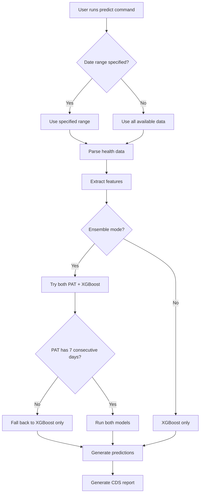

# Auto Window Selection - Complete Implementation Plan

## Table of Contents
1. [Executive Summary](#executive-summary)
2. [Current State Analysis](#current-state-analysis)
3. [Desired Behavior Specification](#desired-behavior-specification)
4. [Technical Implementation Plan](#technical-implementation-plan)
5. [TDD Test Strategy](#tdd-test-strategy)
6. [Migration Path](#migration-path)
7. [Success Metrics](#success-metrics)

## Executive Summary

### Problem Statement
Users must manually specify date ranges without understanding that:
- PAT requires exactly 7 consecutive days of minute-level activity data
- XGBoost requires 30-60 days of data (sparse acceptable)
- Different models have different optimal windows

This creates friction and poor first-run experiences.

### Solution
Implement intelligent auto-window selection that:
1. Automatically analyzes available data
2. Identifies eligible windows for each model
3. Auto-selects optimal overlapping periods
4. Provides clear feedback when models have different requirements

## Current State Analysis

### 1. Current Processing Flow



### 2. Current Window Selection

**File**: `domain/services/window_selection_strategy.py`

Current strategies:
- `MostRecentValidWindowStrategy`: Finds most recent consecutive window
- `BestQualityWindowStrategy`: Finds highest quality consecutive window
- `AllValidWindowsStrategy`: Lists all consecutive windows

**Limitation**: All strategies require consecutive days, unsuitable for XGBoost's sparse tolerance.

### 3. Current CLI Behavior

**File**: `interfaces/cli/commands.py`

```python
# Current options
--auto-find-window  # Uses MostRecentValidWindowStrategy
--window-strategy [recent|best|all]  # Manual strategy selection
```

**Issues**:
- Only finds consecutive windows
- No differentiation between model requirements
- No feedback about why windows were rejected

## Desired Behavior Specification

### 1. Ideal User Experience

#### Scenario A: Both Models Have Valid Windows
```bash
$ python main.py predict export.xml --auto

📊 Analyzing data availability...

PAT Model (Current State Assessment):
✅ Found 5 eligible windows (7 consecutive days each):
   • 2024-12-15 to 2024-12-21 (quality: 100%)
   • 2024-11-01 to 2024-11-07 (quality: 95%)
   • 2024-10-10 to 2024-10-16 (quality: 100%)

XGBoost Model (Tomorrow's Risk Prediction):
✅ Found 3 eligible windows (30+ days, ≥50% coverage):
   • 2024-09-01 to 2024-12-21 (112 days, 71% coverage)
   • 2024-05-15 to 2024-08-20 (98 days, 65% coverage)
   • 2024-01-10 to 2024-03-15 (65 days, 78% coverage)

🎯 Auto-selected optimal window: 2024-12-15 to 2024-12-21
   ├─ PAT: Using full 7-day consecutive window
   └─ XGBoost: Using 112 days of historical context

Generating predictions...
```

#### Scenario B: Only XGBoost Has Valid Data
```bash
$ python main.py predict export.xml --auto

📊 Analyzing data availability...

PAT Model (Current State Assessment):
❌ No eligible windows found
   Requires: 7 consecutive days of minute-level activity
   Your data: Sparse coverage, longest consecutive period is 4 days

XGBoost Model (Tomorrow's Risk Prediction):
✅ Found 2 eligible windows (30+ days, ≥50% coverage):
   • 2024-10-01 to 2024-12-20 (81 days, 52% coverage)
   • 2024-06-01 to 2024-08-15 (76 days, 48% coverage)

🎯 Running XGBoost-only analysis for 2024-10-01 to 2024-12-20
   Note: Current state assessment (PAT) unavailable due to data gaps

Generating predictions...
```

#### Scenario C: Neither Model Has Valid Data
```bash
$ python main.py predict export.xml --auto

📊 Analyzing data availability...

PAT Model (Current State Assessment):
❌ No eligible windows found
   Requires: 7 consecutive days of minute-level activity
   Your data: Maximum 3 consecutive days found

XGBoost Model (Tomorrow's Risk Prediction):
❌ No eligible windows found
   Requires: 30+ days with ≥50% data coverage
   Your data: Maximum window has 22 days with 41% coverage

💡 Suggestions:
   • Collect more data and try again
   • For PAT: Need 7 consecutive days of Apple Watch wear
   • For XGBoost: Need 30+ days of health data (gaps OK)
   • Use --help for manual date range options
```

### 2. Behavior Rules

1. **Auto-Selection Priority**:
   - Prefer windows where both models can run
   - Use most recent window when quality is similar
   - Use highest quality window when recency is similar

2. **Coverage Requirements**:
   - PAT: 100% coverage for 7 consecutive days
   - XGBoost: ≥50% coverage over 30+ days

3. **Window Overlap**:
   - PAT window should fall within XGBoost window when possible
   - XGBoost uses all available historical data up to PAT window

4. **Feedback Clarity**:
   - Always show what was found vs. what was required
   - Explain why windows were accepted/rejected
   - Provide actionable suggestions

## Technical Implementation Plan

### Phase 1: Domain Layer Enhancement

#### 1.1 New Window Selection Strategies

**File**: `domain/services/window_selection_strategy.py`

```python
@dataclass(frozen=True)
class SparseDataWindow:
    """Window allowing non-consecutive days."""
    start_date: date
    end_date: date
    total_days: int  # Calendar days in range
    days_with_data: int  # Days that have records
    coverage_ratio: float  # days_with_data / total_days
    
    @property
    def spans_days(self) -> int:
        return (self.end_date - self.start_date).days + 1

class SparseWindowStrategy(WindowSelectionStrategy):
    """Finds windows with sparse data coverage."""
    
    def find_windows(
        self,
        records: list[Any],
        min_days: int = 30,
        min_coverage: float = 0.5
    ) -> list[SparseDataWindow]:
        """Find windows with sufficient coverage."""
        # Implementation here

class DualModelWindowStrategy:
    """Coordinates window selection for both models."""
    
    def __init__(self):
        self.pat_strategy = MostRecentValidWindowStrategy()
        self.xgboost_strategy = SparseWindowStrategy()
    
    def find_optimal_window(
        self,
        records: dict[str, list[Any]]
    ) -> WindowSelectionResult:
        """Find best window considering both models."""
        # Implementation here
```

#### 1.2 Window Selection Result

```python
@dataclass
class WindowSelectionResult:
    """Complete analysis of available windows."""
    pat_windows: list[DateWindow]
    xgboost_windows: list[SparseDataWindow]
    optimal_window: DateWindow | None
    selection_reason: str
    can_run_pat: bool
    can_run_xgboost: bool
    can_run_ensemble: bool
```

### Phase 2: Application Layer Integration

#### 2.1 Window Analysis Service

**New File**: `application/services/window_analysis_service.py`

```python
class WindowAnalysisService:
    """Analyzes health data for model-specific windows."""
    
    def analyze_data_availability(
        self,
        parsed_data: dict[str, list[Any]]
    ) -> WindowAnalysisReport:
        """Complete analysis of data availability."""
        
        # 1. Analyze for PAT (7 consecutive days)
        pat_windows = self._analyze_pat_windows(
            parsed_data['activity_records']
        )
        
        # 2. Analyze for XGBoost (30+ sparse days)
        xgboost_windows = self._analyze_xgboost_windows(
            parsed_data['sleep_records'],
            parsed_data['heart_rate_records']
        )
        
        # 3. Find optimal overlap
        optimal = self._find_optimal_overlap(
            pat_windows, 
            xgboost_windows
        )
        
        return WindowAnalysisReport(
            pat_windows=pat_windows,
            xgboost_windows=xgboost_windows,
            optimal_selection=optimal,
            recommendations=self._generate_recommendations()
        )
```

#### 2.2 Pipeline Enhancement

**File**: `application/use_cases/process_health_data_use_case.py`

```python
class MoodPredictionPipeline:
    def process_apple_health_file(
        self,
        file_path: Path,
        start_date: date | None = None,
        end_date: date | None = None,
        auto_select_window: bool = False
    ) -> PipelineResult:
        
        if auto_select_window and not (start_date or end_date):
            # New auto-selection flow
            analysis = self.window_analyzer.analyze_data_availability(
                parsed_data
            )
            
            if analysis.optimal_selection:
                start_date = analysis.optimal_selection.start_date
                end_date = analysis.optimal_selection.end_date
                logger.info(f"Auto-selected: {start_date} to {end_date}")
            else:
                # Handle no valid windows case
                return self._create_no_data_result(analysis)
```

### Phase 3: Interface Layer Enhancement

#### 3.1 CLI Command Updates

**File**: `interfaces/cli/commands.py`

```python
@click.option(
    "--auto/--no-auto",
    default=False,
    help="Automatically select optimal prediction window"
)
def predict_command(..., auto: bool):
    if auto:
        # Use window analysis service
        result = pipeline.process_with_auto_window_selection(...)
        
        # Display analysis before processing
        display_window_analysis(result.window_analysis)
        
        if not result.has_valid_window:
            display_data_collection_guidance()
            return
```

#### 3.2 Enhanced Output Formatting

```python
class WindowAnalysisFormatter:
    """Formats window analysis for CLI display."""
    
    def format_analysis(self, analysis: WindowAnalysisReport) -> str:
        lines = ["📊 Analyzing data availability...\n"]
        
        # PAT section
        lines.append("PAT Model (Current State Assessment):")
        if analysis.pat_windows:
            lines.append(f"✅ Found {len(analysis.pat_windows)} eligible windows")
            # Format windows...
        else:
            lines.append("❌ No eligible windows found")
            # Add requirements and reasons...
```

## TDD Test Strategy

### 1. Unit Tests

#### Domain Layer Tests
```python
# test_sparse_window_strategy.py
class TestSparseWindowStrategy:
    def test_finds_window_with_exact_minimum_coverage(self):
        """Should find window with exactly 50% coverage over 30 days."""
        
    def test_rejects_window_below_minimum_coverage(self):
        """Should reject window with 49% coverage."""
        
    def test_handles_multiple_valid_windows(self):
        """Should return all windows meeting criteria, sorted by recency."""

# test_dual_model_strategy.py  
class TestDualModelWindowStrategy:
    def test_selects_overlapping_window_when_available(self):
        """Should prefer windows where both models can run."""
        
    def test_falls_back_to_xgboost_when_no_pat_windows(self):
        """Should run XGBoost-only when PAT has no valid windows."""
```

#### Application Layer Tests
```python
# test_window_analysis_service.py
class TestWindowAnalysisService:
    def test_complete_analysis_with_sparse_data(self):
        """Should analyze both models with realistic sparse data."""
        
    def test_generates_appropriate_recommendations(self):
        """Should provide actionable recommendations based on data gaps."""
```

### 2. Integration Tests

```python
# test_auto_window_integration.py
class TestAutoWindowIntegration:
    def test_end_to_end_auto_selection_with_both_models(self):
        """Full pipeline test with overlapping windows."""
        
    def test_end_to_end_with_xgboost_only(self):
        """Full pipeline when only XGBoost has valid data."""
        
    def test_cli_output_formatting(self):
        """Verify CLI displays analysis correctly."""
```

### 3. Test Data Fixtures

```python
# fixtures/window_test_data.py
def create_sparse_health_data(
    start_date: date,
    days: int,
    coverage: float
) -> dict[str, list[Any]]:
    """Generate test data with specific coverage patterns."""

def create_consecutive_activity_data(
    start_date: date,
    days: int
) -> list[ActivityRecord]:
    """Generate consecutive activity records for PAT testing."""
```

## Migration Path

### Phase 1: Foundation (Week 1)
1. Implement `SparseWindowStrategy` with tests
2. Create `WindowAnalysisService` with basic functionality
3. Add integration tests for new components

### Phase 2: Integration (Week 2)
1. Integrate window analysis into pipeline
2. Update CLI to support `--auto` flag
3. Implement output formatters
4. Test with real data files

### Phase 3: Polish (Week 3)
1. Enhance error messages and recommendations
2. Add progress indicators for analysis
3. Performance optimization for large files
4. Documentation updates

### Phase 4: Release (Week 4)
1. Beta testing with contributors
2. Address feedback
3. Update README and examples
4. Create GitHub release

## Success Metrics

### Quantitative
- 90% of new users successfully generate predictions on first run
- Analysis time < 5 seconds for typical health export
- Zero regression in existing functionality

### Qualitative
- Clear, actionable feedback for data issues
- Reduced support questions about date ranges
- Positive feedback from OSS contributors

## Implementation Checklist

- [ ] Domain layer window strategies
- [ ] Window analysis service
- [ ] Pipeline integration
- [ ] CLI command updates
- [ ] Output formatters
- [ ] Unit tests (>95% coverage)
- [ ] Integration tests
- [ ] Performance tests
- [ ] Documentation updates
- [ ] Migration guide

## Next Steps

1. Review and approve this plan
2. Create detailed GitHub issues for each phase
3. Set up feature branch with CI/CD
4. Begin Phase 1 implementation with TDD

---

This plan ensures we build the feature correctly from the start, with comprehensive testing and clear migration path.