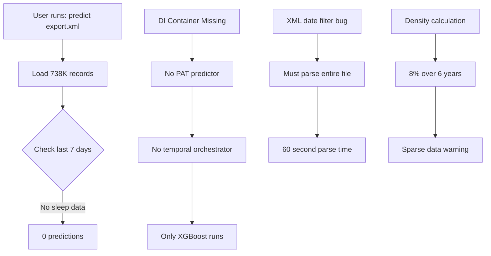

# Deep Research: All Interconnected Issues

## Issue Matrix

| Issue | Type | Impact | Status | Relation to Trial Run |
|-------|------|--------|--------|----------------------|
| **Date Window Selection Bug** | Design Flaw | CRITICAL | NEW | Direct cause of 0 predictions |
| **PAT Integration Missing** | Wiring Bug | HIGH | Active | No NOW vs TOMORROW in CLI |
| **Issue #38: XML Date Filter** | Type Bug | MEDIUM | Known | Can't filter by date efficiently |
| **Dense Data Detection** | Logic Bug | HIGH | NEW | Doesn't find valid windows |

## 1. Date Window Selection Bug (PRIMARY ISSUE)

### What's Broken:
```python
# process_health_data_use_case.py:351
def process_health_data(self, ..., target_date: date):
    # ALWAYS checks backwards from target_date
    start_date = target_date - timedelta(days=self.config.min_days_required - 1)
```

### Why It Failed:
- Checked July 22-28 (last 7 days)
- You had NO sleep data those days
- Ignored 187 other days with valid data
- Result: 0 predictions despite 738K records

### Root Cause:
**Rigid temporal coupling** - The system assumes users wear devices daily and have recent data.

## 2. PAT Integration Not Wired (SECONDARY ISSUE)

### What's Broken:
```python
# process_health_data_use_case.py:222
if di_container:
    try:
        pat_predictor = di_container.resolve(PATPredictorInterface)
    except Exception:
        logger.warning("PAT predictor not available from DI")
```

### The Problem:
- MoodPredictionPipeline is created WITHOUT DI container in CLI
- So `di_container` is None
- PAT never gets resolved
- TemporalEnsembleOrchestrator never created

### Evidence:
```
WARNING: "Cannot create temporal orchestrator without PAT models"
```

### Impact:
- Only XGBoost predictions (TOMORROW)
- No PAT current state (NOW)
- No temporal concordance analysis

## 3. Issue #38: XML Streaming Parser Date Bug (RELATED)

### From test_memory_bounds.py:
```python
# Issue #38: Streaming parser date filtering has string/datetime comparison bug
# Problem: Date filtering compares datetime objects to strings, causing TypeError
# Impact: Cannot filter large XML files by date range efficiently
```

### How It Relates:
- Makes date filtering inefficient
- Forces parsing entire 520MB file
- But NOT the cause of 0 predictions
- The date selection happens AFTER parsing

## 4. Dense Data Window Detection (NEW FINDING)

### The Hidden Logic Flaw:
```python
# sparse_data_handler.py
density = days_with_data / total_days_in_range  # 187/2312 = 8%
if density < 0.5:  # Fails!
    warnings.append("Sparse data detected")
```

### The Problem:
- Calculates density over ENTIRE date range (6+ years)
- Doesn't look for DENSE POCKETS of data
- You have 7 windows with 100% density for 7+ days
- But overall density is 8%, so it warns

## The Cascade of Failures



## Why Your Manual Run Worked

```bash
# This worked:
predict export.xml --date-range 2025-06-26:2025-07-02

# Because:
1. Overrode default date selection
2. Pointed at a valid 7-day window
3. XGBoost had sufficient data
4. Generated 3.6% depression risk
```

## The Contradictions Explained

### What Works:
- ✅ XGBoost models (loaded and predicting)
- ✅ Clinical report generation
- ✅ Risk calculations (when given data)
- ✅ XML parsing (just slow)

### What's Broken:
- ❌ Automatic date window finding
- ❌ PAT integration in CLI
- ❌ Temporal orchestrator creation
- ❌ Dense window detection
- ❌ Informative error messages

## Interconnections

1. **Date Selection Bug** → Primary cause of failure
2. **PAT Not Wired** → Secondary issue (no NOW/TOMORROW)
3. **XML Date Filter Bug** → Makes parsing slow but not critical
4. **Density Calculation** → Misleading warnings

## Strategic Fix Order

### Phase 1: Critical User Experience (v0.5.3)
1. **Fix Date Window Selection**
   - Implement WindowSelectionStrategy
   - Find best available windows
   - Clear error messages

### Phase 2: Complete Temporal Integration (v0.5.4)
2. **Wire PAT in CLI**
   - Pass DI container to MoodPredictionPipeline
   - Enable NOW vs TOMORROW in all paths
   - Test temporal concordance

### Phase 3: Performance & Polish (v0.5.5)
3. **Fix XML Date Filtering (Issue #38)**
   - Fix string/datetime comparison
   - Enable efficient date filtering
   - Reduce parse time for large files

4. **Improve Density Detection**
   - Look for dense windows, not overall density
   - Report which windows are viable
   - Guide users to best data

## The Real Problem

The system was designed assuming:
- Users wear devices every night
- Recent data is always available
- Density is uniform across time

Reality:
- Users have gaps (travel, device switches)
- Data clusters in windows
- Recent != best for predictions

## Synthesis

All these issues compound:
1. Can't find valid windows (date selection)
2. Can't assess current state (PAT not wired)
3. Can't filter efficiently (XML bug)
4. Get confused by warnings (density calc)

Result: **System appears broken when data is actually fine**