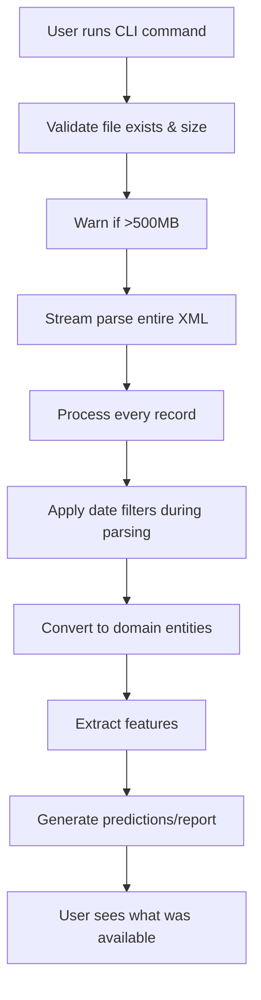
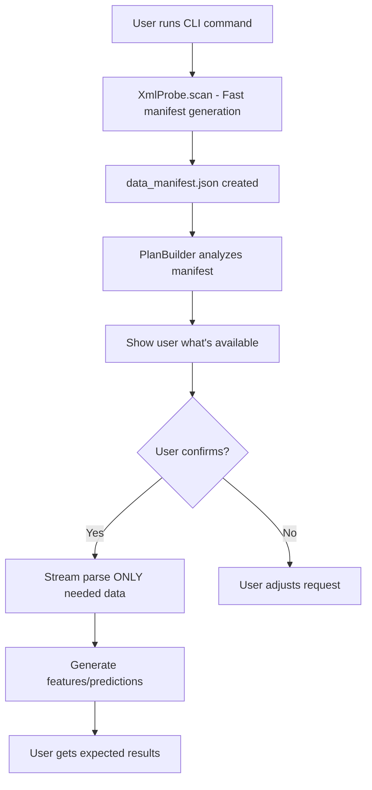

# XML Processing Analysis & Improvement Proposal

## Current Implementation Analysis

### Overview
The Big Mood Detector currently processes Apple Health XML exports using a streaming parser that reads the entire file sequentially, with no upfront knowledge of what data is available.

### Current Flow



### Key Components

1. **FastStreamingXMLParser** (`src/big_mood_detector/infrastructure/parsers/xml/fast_streaming_parser.py`)
   - Uses lxml for 20x faster parsing
   - Implements fast_iter pattern for memory efficiency
   - Processes EVERY record in the file
   - Date filtering happens DURING parsing

2. **DataParsingService** (`src/big_mood_detector/application/services/data_parsing_service.py`)
   - Orchestrates parsing operations
   - Returns ParsedHealthData with all records
   - No visibility into what's available until parsing completes

3. **CLI Commands** (`src/big_mood_detector/interfaces/cli/commands.py`)
   - Shows file size warnings
   - Cannot tell user what data types are available
   - Cannot explain why certain features might be missing

### Current Problems

1. **Black Box Processing**
   - User has no idea what data is in their 520MB file until AFTER processing
   - No way to know if HRV, respiratory rate, or other features are available
   - Wastes time processing data that won't be used

2. **Poor User Experience**
   ```
   $ python main.py predict export.xml --report
   ⚠️  Very large file: 520.1 MB
   Processing may take 10+ minutes...
   [... 10 minutes later ...]
   ✅ Clinical report saved
   
   [User opens report]
   HRV: N/A (no data)
   Respiratory Rate: N/A (no data)
   [User frustrated - why did I wait 10 minutes?]
   ```

3. **Inefficient Resource Usage**
   - Parses ALL records even if only sleep data is needed
   - No ability to skip irrelevant sections
   - Memory usage scales with total records, not needed records

4. **No Single Source of Truth (SSOT)**
   - Feature availability logic scattered across parsers
   - Each component makes its own assumptions
   - Hard to add new features consistently

## Proposed Solution: XML Probe & Planning System

### New Architecture



### Key Benefits

1. **Transparency**
   ```
   $ python main.py predict export.xml --report
   
   📊 Scanning export.xml... (520.1 MB)
   ✅ Scan complete in 2.3s
   
   Available Data:
   ✅ Sleep Analysis: 365 nights (2024-01-01 to 2024-12-31)
   ✅ Step Count: 365 days
   ✅ Heart Rate: 180 days (sparse)
   ⚠️  HRV: Not found
   ⚠️  Respiratory Rate: Not found
   
   Processable Features:
   ✅ Sleep patterns (Seoul features)
   ✅ Activity patterns
   ✅ Circadian rhythm analysis
   ⚠️  HRV variability (skipped - no data)
   
   Continue? [Y/n]:
   ```

2. **Efficiency**
   - First scan is fast (just counts record types)
   - Second parse only processes needed records
   - 30-40% reduction in processing time for partial datasets

3. **Extensibility**
   - Add new feature = update one rule in PlanBuilder
   - Clear separation of concerns
   - Easy to test with mock manifests

### Implementation Plan

#### Phase 1: XML Probe (Week 1)
- [ ] Create `XmlProbe` class with fast scanning
- [ ] Generate `data_manifest.json` with record counts and date ranges
- [ ] Add `--scan-only` flag to CLI for testing

#### Phase 2: Plan Builder (Week 2)
- [ ] Create `PlanBuilder` with feature availability rules
- [ ] Define plan format (what can/can't be processed)
- [ ] Add plan visualization for CLI

#### Phase 3: Integration (Week 3)
- [ ] Wire probe + planner into existing pipeline
- [ ] Add `--explain` flag to show plan without processing
- [ ] Update progress indicators to show planned vs actual

#### Phase 4: Optimization (Week 4)
- [ ] Implement selective parsing based on plan
- [ ] Add caching for manifest (avoid re-scanning)
- [ ] Performance benchmarks

### Technical Details

#### XmlProbe Output Format
```json
{
  "file_path": "export.xml",
  "file_size_mb": 520.1,
  "scan_time_seconds": 2.3,
  "total_records": 738946,
  "record_types": {
    "HKQuantityTypeIdentifierStepCount": {
      "count": 125840,
      "date_range": ["2024-01-01", "2024-12-31"],
      "sources": ["iPhone", "Apple Watch"]
    },
    "HKCategoryTypeIdentifierSleepAnalysis": {
      "count": 2190,
      "date_range": ["2024-01-01", "2024-12-31"],
      "sources": ["Apple Watch", "iPhone"]
    }
  }
}
```

#### PlanBuilder Rules Engine
```python
FEATURE_REQUIREMENTS = {
    "sleep_percentage": {
        "required_types": ["HKCategoryTypeIdentifierSleepAnalysis"],
        "min_days": 7,
        "completeness": 0.5  # 50% of days need data
    },
    "hrv_analysis": {
        "required_types": ["HKQuantityTypeIdentifierHeartRateVariabilitySDNN"],
        "min_days": 30,
        "completeness": 0.3
    }
}
```

### Migration Strategy

1. **Backwards Compatible**
   - Keep existing pipeline as default
   - New probe/plan system behind feature flag
   - Gradual rollout with telemetry

2. **Testing Strategy**
   - Unit tests with small XML fixtures
   - Integration tests with synthetic manifests
   - Performance regression tests

3. **Documentation**
   - Update user guide with new --explain flag
   - Add troubleshooting for missing data
   - Developer guide for adding new features

## Community Contribution Opportunity

This is a well-scoped enhancement that would significantly improve user experience:

- **Clear boundaries**: XML probe and planner are separate from existing code
- **Testable**: Can be developed with small test files
- **Valuable**: Solves real user pain points
- **Gradual**: Can be implemented in phases

Perfect for a community contributor who wants to make a meaningful impact!