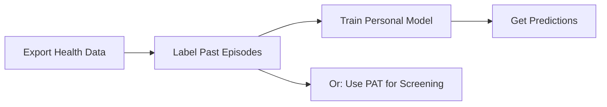

## XGBoost models require user-labeled mood episodes - not "out of the box" predictions

### Summary
Critical discovery: The XGBoost models REQUIRE users to label their historical mood episodes before they can make predictions. They are personalized medicine tools, not general diagnostic models. This fundamental misunderstanding affects all documentation and user expectations.

### The Problem
Our documentation implies:
- Upload Apple Health data → Get mood predictions ❌

Reality from the papers:
- Upload data → Label your past episodes → Model learns YOUR patterns → Get predictions ✓

### Evidence from Literature

**XGBoost Paper (Seoul):**
> "we selected a specific 60-day range for each patient where half of the range represented episodic days"

> "a trained psychiatrist assessed the presence of mood episode recurrence"

The models were trained on LABELED episodes. They need to know when YOU had episodes to learn YOUR patterns.

**PAT Paper (Dartmouth):**
> "pretrained on week-long actigraphy data from... 21,538 participants"

PAT is self-supervised and can work without labels (but less accurate).

### Critical Confusion: Two Types of "Baselines"

We conflated:
1. **Statistical baselines** - Personal mean/std for Z-scores (what we investigated)
2. **Episode baselines** - Your labeled mood history (what XGBoost NEEDS)

### Current State Assessment

**What exists:**
- ✅ Labeling CLI commands (`big-mood label`)
- ✅ Episode storage (SQLite)
- ✅ Domain services for episode management
- ✅ Models load correctly

**What's broken:**
- ❌ All documentation implies "out of the box" predictions
- ❌ No onboarding flow for labeling
- ❌ No personal model training pipeline
- ❌ User expectations completely wrong

### Impact
- Users will be confused when predictions don't work
- The tool is more powerful (truly personalized) but more demanding
- Current messaging is fundamentally incorrect

### Required Changes

**1. Update ALL Documentation**
```markdown
# Old
"Predicts mood episodes from your Apple Health data"

# New
"Learns YOUR mood patterns to predict future episodes
(requires labeling your past episodes first)"
```

**2. Change Default Workflow**
- Add mandatory labeling step
- Check for sufficient labeled data
- Prevent predictions without labels
- Add tutorial/onboarding

**3. Clarify Model Capabilities**
- XGBoost: Requires YOUR labeled episodes (personalized)
- PAT: Can do general screening without labels (less accurate)
- Ensemble: Best of both with sufficient data

**4. Fix README.md**
Remove claims about immediate predictions. Add:
- Labeling requirements
- Minimum data needs (30-60 days with episodes)
- Personalized medicine approach
- Clear workflow diagram

### Proposed User Journey



### Why This Matters
- **Accuracy**: Personalized models are more accurate
- **Ethics**: Avoids false universality claims
- **Trust**: Sets correct expectations
- **Science**: Aligns with how the papers actually work

### Recommendation
1. **v0.5.0**: Fix documentation, add warnings
2. **v0.6.0**: Implement personal training pipeline
3. **Future**: Research transfer learning from Korean cohort

### The Silver Lining
This is actually MORE impressive - true personalized medicine! But we must be honest about requirements.

### References
- `/CRITICAL_MODEL_REQUIREMENTS_DISCOVERY.md` - Full analysis
- `/HOW_THE_MODELS_ACTUALLY_WORK.md` - User-facing explanation
- Original papers in `/docs/literature/`

### Labels
- critical
- documentation
- breaking-change
- user-experience

### Checklist
- [ ] Update README.md with correct workflow
- [ ] Add labeling requirements to all docs
- [ ] Create onboarding tutorial
- [ ] Add data sufficiency checks
- [ ] Implement personal model training
- [ ] Add warnings when predictions attempted without labels